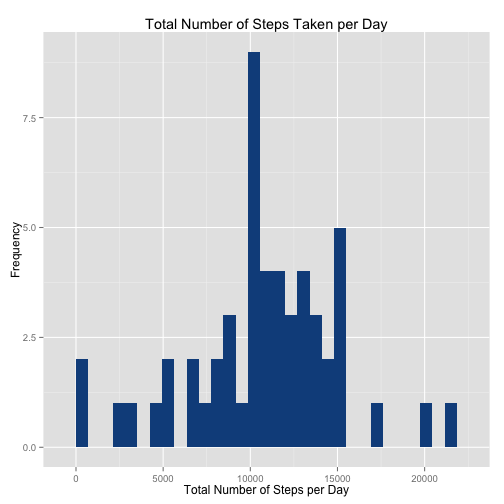
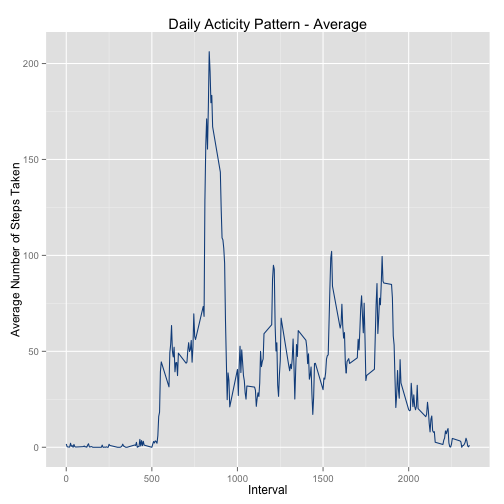

## Loading packages required

At the very beginning we need to load the R packages we will use subsequently. We will use following packages:  

R-Package  | Use
------------- | -------------
lubridate  | Convenient handling/manipulation of date attributes
dplyr  | Data manipulation - filtering, summarizing etc.
ggplot2  | Advanced visualization
mice  | Advanced imputation


```r
library(lubridate)
library(dplyr)
library(ggplot2)
library(mice)
library(reshape2)
```


## Loading and preprocessing the data

We use two steps for loading and preprocessing of the data:  
1. Set the working directory to the directory you have created forking/cloning the github repository to your PC  
2. Load the data using R's `read.csv` function wrapped around another function - `unz` - which allows for unzipping files.


```r
setwd("~/Dropbox/RepData_PeerAssessment1")
data <- read.csv(unz("activity.zip", "activity.csv"),stringsAsFactors=F)
```

We will need later weekdays and weekends. Therefore we determine the days (Monday - Sunday) and wether it is a normal week day (working day) or a week end (Saturday,Sunday). Furtheron we include a unique identifier (id) just in case we would need it.


```r
data<-data %>% 
  mutate(weekday=wday(date,label=TRUE)) %>% 
  mutate(weekday_type=as.factor(ifelse(weekday=="Sat"|weekday=="Sun","week_end","working_day"))) %>% 
  mutate(id=as.character(1:nrow(data)))
```

Finally we can have a look to the results using R's `summary` function.  


```r
summary(data)
```

```
##      steps            date              interval       weekday    
##  Min.   :  0.00   Length:17568       Min.   :   0.0   Sun  :2304  
##  1st Qu.:  0.00   Class :character   1st Qu.: 588.8   Mon  :2592  
##  Median :  0.00   Mode  :character   Median :1177.5   Tues :2592  
##  Mean   : 37.38                      Mean   :1177.5   Wed  :2592  
##  3rd Qu.: 12.00                      3rd Qu.:1766.2   Thurs:2592  
##  Max.   :806.00                      Max.   :2355.0   Fri  :2592  
##  NA's   :2304                                         Sat  :2304  
##       weekday_type        id           
##  week_end   : 4608   Length:17568      
##  working_day:12960   Class :character  
##                      Mode  :character  
##                                        
##                                        
##                                        
## 
```


## What is mean total number of steps taken per day?

To answer this question we use dplyr to aggregate the data frame - calculating total steps per day. 


```r
daily<-data %>% group_by(date) %>% summarize(totalsteps=sum(steps))
```

A histogram visualizes the distribution of total steps per day.


```r
ggplot(data=daily,aes(x=totalsteps))+geom_histogram(fill="dodgerblue4")+
  ggtitle("Total Number of Steps Taken per Day") +
  labs(x="Total Number of Steps per Day",y="Frequency") 
```

 


Then we use R's `mean` and `median` function which allows us to calculate the mean respectively median value.  


```r
mean(daily$totalsteps,na.rm=T)
```

```
## [1] 10766.19
```

```r
median(daily$totalsteps,na.rm=T)
```

```
## [1] 10765
```

As we see the **mean total number of steps taken per day** is **10,766.19**   while the **median total number of steps taken per day** is **10,765.00**

## What is the average daily activity pattern?

To answer this question we use dplyr to aggregate the data frame - calculating the average number of steps taken per time interval. 


```r
byinterval<-data %>% group_by(interval) %>% summarize(averagesteps=mean(steps,na.rm=T))
```

A line diagram visualizes the desired pattern.


```r
ggplot(data=byinterval,aes(x=interval,y=averagesteps))+geom_line(colour="dodgerblue4")+
  ggtitle("Daily Acticity Pattern - Average") +
  labs(x="Interval",y="Average Number of Steps Taken") 
```

 


Filtering the aggregated data frame returns the interval which has - on average - the highest number of steps.


```r
byinterval %>% filter(averagesteps==max(averagesteps,na.rm=T))
```

```
## Source: local data frame [1 x 2]
## 
##   interval averagesteps
## 1      835     206.1698
```


## Imputing missing values


```r
sum(is.na(data))
```

```
## [1] 2304
```

For the imputation we will use the R package **mice**. mice implements the imputation of NA values by predictive mean matching. Compared with simple methods - like imputing for all missing values the mean - or standard methods based on linear regression and the normal distribution, PMM produces imputed values that are much more like real values. If the original variable is skewed, the imputed values will also be skewed. If the original variable is bounded by 0 and 806 as in our case, the imputed values will also be bounded by 0 and 806.

For background on mice and its imputation algorithm refer to http://www.jstatsoft.org/v45/i03/paper.


Imputation is very straightforward.


```r
set.seed(15)
imputations <- mice(data, method=c("pmm"),m = 1)
```

```
## 
##  iter imp variable
##   1   1  steps
##   2   1  steps
##   3   1  steps
##   4   1  steps
##   5   1  steps
```

Having produced the imputations we can create the new data frame by using the `complete` function.  


```r
new.data<-complete(imputations)
```

Using the `summary` function we can compare the original and the imputed data frame. As we see both data frames seem to be distributed in a similar way.


```r
summary(data)
```

```
##      steps            date              interval       weekday    
##  Min.   :  0.00   Length:17568       Min.   :   0.0   Sun  :2304  
##  1st Qu.:  0.00   Class :character   1st Qu.: 588.8   Mon  :2592  
##  Median :  0.00   Mode  :character   Median :1177.5   Tues :2592  
##  Mean   : 37.38                      Mean   :1177.5   Wed  :2592  
##  3rd Qu.: 12.00                      3rd Qu.:1766.2   Thurs:2592  
##  Max.   :806.00                      Max.   :2355.0   Fri  :2592  
##  NA's   :2304                                         Sat  :2304  
##       weekday_type        id           
##  week_end   : 4608   Length:17568      
##  working_day:12960   Class :character  
##                      Mode  :character  
##                                        
##                                        
##                                        
## 
```

```r
summary(new.data)
```

```
##      steps            date              interval       weekday    
##  Min.   :  0.00   Length:17568       Min.   :   0.0   Sun  :2304  
##  1st Qu.:  0.00   Class :character   1st Qu.: 588.8   Mon  :2592  
##  Median :  0.00   Mode  :character   Median :1177.5   Tues :2592  
##  Mean   : 37.78                      Mean   :1177.5   Wed  :2592  
##  3rd Qu.: 11.00                      3rd Qu.:1766.2   Thurs:2592  
##  Max.   :806.00                      Max.   :2355.0   Fri  :2592  
##                                                       Sat  :2304  
##       weekday_type        id           
##  week_end   : 4608   Length:17568      
##  working_day:12960   Class :character  
##                      Mode  :character  
##                                        
##                                        
##                                        
## 
```

For ease of calcualtion we use some features of mice's `complete` function to create a combined data frame - containing the original and the imputed data. We melt this data frame (using reshape) and rename/polish the attributes.  


```r
combined.data<-complete(imputations,action="broad",include=T)
combined.data<-combined.data %>% select(id.0,date.0,steps.0,steps.1)
combined.melt<-melt(combined.data)
combined.melt<-combined.melt %>%
    rename(id=id.0,date=date.0,data.source=variable,steps=value) %>%
    mutate(data.source=ifelse(data.source=="steps.0","Original Dataframe","Imputed Dataframe"))
```

After that we can again calculate the total daily steps. This time splitted between the original and the imputed data set.


```r
combined.daily.steps<-as.data.frame(combined.melt %>% group_by(date,data.source) %>% summarize(totalsteps=sum(steps)))
```


The histogram based on this aggregated data shows that both data frames are also similar on an aggregated daily level - not really surprising based on the summary of the detailed data done above.


```r
ggplot(data=combined.daily.steps,aes(x=totalsteps))+
  geom_histogram(fill="dodgerblue4")+
  facet_wrap(~data.source)+
  ggtitle("Total Number of Steps Taken per Day") +
  labs(x="Total Number of Steps per Day",y="Frequency") 
```

 

The median of the daily total steps is almost identical between both data frames while the mean is still reasonably close.


```r
combined.daily.steps%>% group_by(data.source) %>% summarize(Mean.Total.Daily.Steps=mean(totalsteps,na.rm=T),Median.Total.Daily.Steps=median(totalsteps,na.rm=T))
```

```
## Source: local data frame [2 x 3]
## 
##          data.source Mean.Total.Daily.Steps Median.Total.Daily.Steps
## 1  Imputed Dataframe               10881.02                    10775
## 2 Original Dataframe               10766.19                    10765
```


## Are there differences in activity patterns between weekdays and weekends?

We follow a very similar strategy as above creating an aggregated data frame this time not just based on the interval but also the weekday_type and using the imputed data frame. 


```r
byinterval<-new.data %>% group_by(interval,weekday_type) %>% summarize(averagesteps=mean(steps,na.rm=T))
```

The resulting line chart shows a difference between the week end and non weekend pattern: weekends showing a more 'balanced' activity pattern.


```r
ggplot(data=byinterval,aes(x=interval,y=averagesteps))+geom_line(colour="dodgerblue4")+facet_wrap(~weekday_type)+
ggtitle("Daily Acticity Pattern - Average") +
labs(x="Interval",y="Average Number of Steps Taken")
```

 

The resulting line chart shows a difference between the week end and non weekend pattern: weekends showing a more 'balanced' activity pattern in the interval 750 - 2000.


